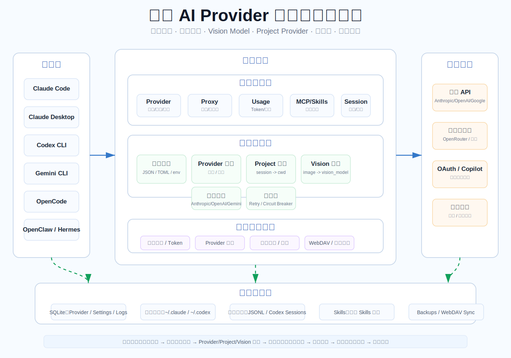
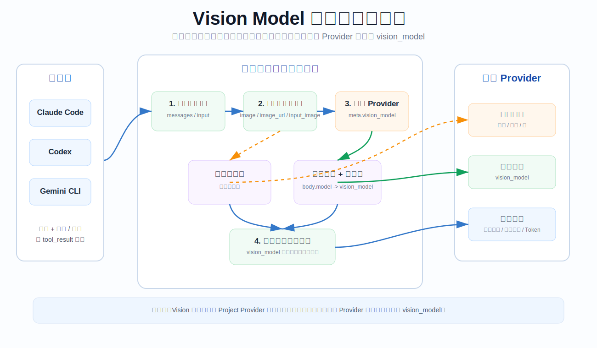
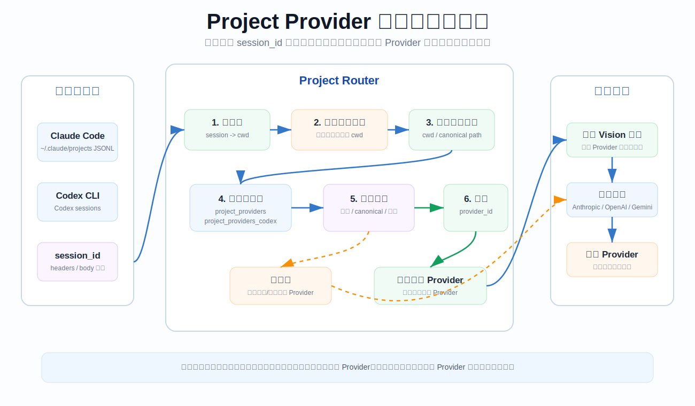
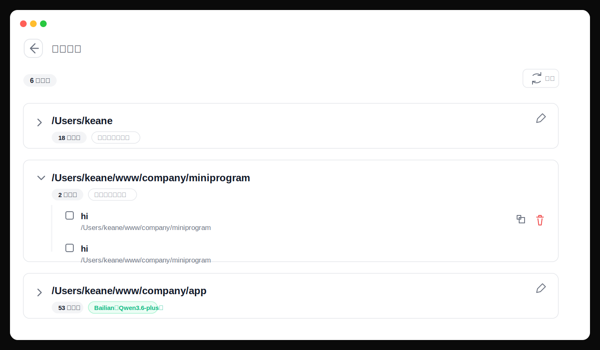
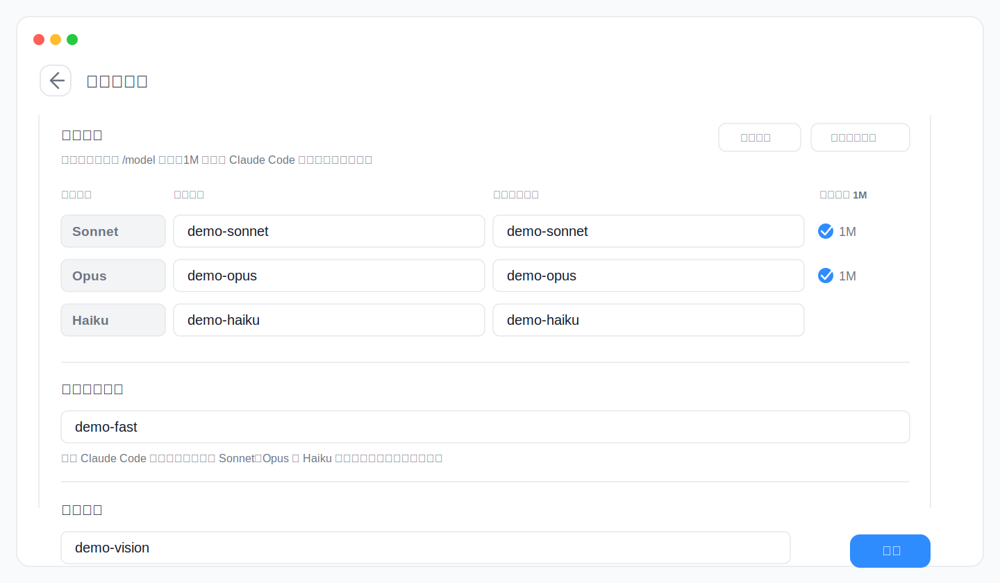

<div align="center">

# CC-Gateway-Pro

### Local AI Provider Gateway for Claude Code, Claude Desktop, Codex, Gemini CLI, OpenCode, OpenClaw and Hermes

[](https://github.com/KeaneFeng/cc-gateway-pro/releases)
[](https://github.com/KeaneFeng/cc-gateway-pro/releases)
[](https://tauri.app/)
[](https://github.com/farion1231/cc-switch)

English | [中文](README_ZH.md) | [日本語](README_JA.md) | [Changelog](CHANGELOG.md)

</div>

## What Is CC-Gateway-Pro?

CC-Gateway-Pro is a desktop control plane and local AI Provider Gateway for AI coding tools. It manages provider profiles, writes each tool's native configuration files, and can route live requests through a local proxy for logging, failover, model transformation, project-level provider binding, and Vision Model routing.

This project is forked from [farion1231/cc-switch](https://github.com/farion1231/cc-switch). It keeps the original visual provider-switching idea, then extends it with a Rust/Tauri local gateway, multi-app configuration management, request routing, usage analytics, synchronization, and provider-specific integrations.

## Supported Apps

| App            | Main capabilities                                                                                                |
| -------------- | ---------------------------------------------------------------------------------------------------------------- |
| Claude Code    | Provider switching, local proxy takeover, project routing, Vision Model routing, MCP, prompts, skills, sessions  |
| Claude Desktop | Official and third-party profiles, direct mode, local routed mode, model route mapping                           |
| Codex          | Provider switching, local proxy takeover, project routing, OAuth/Copilot helpers, MCP, prompts, skills, sessions |
| Gemini CLI     | Provider switching, local proxy takeover, MCP, prompts, skills, sessions                                         |
| OpenCode       | Provider presets, common config snippets, MCP, prompts, skills, sessions                                         |
| OpenClaw       | Provider presets, workspace files, agent defaults, tool and environment panels                                   |
| Hermes Agent   | Provider presets, memory panel, MCP and skills management                                                        |

## Core Features

- **Provider management**: 50+ presets, custom providers, drag sorting, import/export, endpoint speed tests, balance and quota helpers.
- **Local proxy gateway**: Tauri/Rust + Axum proxy on `127.0.0.1:15721` by default, with per-app takeover for Claude, Claude Desktop, Codex and Gemini.
- **API format adaptation**: Anthropic, OpenAI Chat Completions, OpenAI Responses, Gemini and provider-specific compatibility paths.
- **Project-level routing**: Claude and Codex sessions can be mapped from local session files to project directories, then routed to project-bound providers.
- **Vision Model routing**: requests containing image blocks can automatically switch to the provider's configured `vision_model`.
- **High availability**: per-app failover queues, circuit breakers, retries, health state, stream and non-stream timeout controls.
- **Usage analytics**: request logs, token usage, cost estimation, trends, provider/model breakdowns and custom pricing.
- **MCP, prompts and skills**: unified management, sync across supported apps, deep links, repository/ZIP skill installation.
- **Data safety**: SQLite storage, atomic config writes, automatic backups, configurable storage directory and WebDAV sync.

## Architecture Diagrams

### Local AI Provider Gateway



### Vision Model Proxy Workflow



### Project Provider Proxy Workflow



More diagrams for failover, usage logging, MCP/Prompts/Skills synchronization and the full request chain are available in [Architecture and Flows](docs/architecture-and-flows-zh.md).

## Interface Preview

|                  Main screen                   |                  Add provider                  |
| :--------------------------------------------: | :--------------------------------------------: |
|  |  |

|                                Project routing                                |                                  Vision Model configuration                                  |
| :---------------------------------------------------------------------------: | :------------------------------------------------------------------------------------------: |
|  |  |

## Installation

Download the latest build from [GitHub Releases](https://github.com/KeaneFeng/cc-gateway-pro/releases).

System requirements:

- macOS 12 or later
- Windows 10 or later
- Linux distributions with a modern WebKitGTK runtime, such as Ubuntu 22.04+, Debian 11+ or Fedora 34+

### macOS Homebrew

Many users need to refresh Homebrew metadata before the cask can be found or updated correctly:

```bash
brew update
brew tap KeaneFeng/cc-gateway-pro
brew install --cask cc-gateway-pro
```

Upgrade:

```bash
brew update
brew upgrade --cask cc-gateway-pro
```

### Manual Download

- Windows: download the `.msi` installer or portable `.zip` from [Releases](https://github.com/KeaneFeng/cc-gateway-pro/releases).
- macOS: download the `.dmg` from [Releases](https://github.com/KeaneFeng/cc-gateway-pro/releases).
- Linux: download the `.deb`, `.rpm` or `.AppImage` from [Releases](https://github.com/KeaneFeng/cc-gateway-pro/releases).
- Arch Linux: install with `paru -S cc-gateway-pro-bin`.

## Build From Source

Prerequisites: Node.js 22+, pnpm and Rust stable.

```bash
pnpm install
pnpm tauri dev
pnpm tauri build
```

The repository also includes a helper:

```bash
./build.sh --dev
./build.sh --release
./build.sh --dmg
./build.sh --sha
```

## Documentation

- [Chinese README](README_ZH.md)
- [Japanese README](README_JA.md)
- [User manual](docs/user-manual/zh/README.md)
- [Architecture and flows](docs/architecture-and-flows-zh.md)
- [Proxy guide](docs/proxy-guide-zh.md)
- [Release notes](docs/release-notes/v3.15.0-zh.md)

## Data Locations

- Main database: `~/.cc-gateway-pro/cc-gateway-pro.db`
- Device settings: `~/.cc-gateway-pro/settings.json`
- Backups: `~/.cc-gateway-pro/backups/`
- Skills: `~/.cc-gateway-pro/skills/`

The storage directory can be moved to Dropbox, OneDrive, iCloud, NAS or another synchronized folder from the settings page.

## Credits

- Forked from [farion1231/cc-switch](https://github.com/farion1231/cc-switch)
- Built with Tauri, Rust, React, TypeScript and Tailwind CSS

## License

MIT © Keane Feng
