# CC-Gateway-Pro 架构与核心流程

本文根据当前代码实现整理 CC-Gateway-Pro 的运行方式，重点说明本项目相对原始 cc-switch 的增强：本地代理网关、项目级 Provider 绑定、Vision Model 自动路由、故障转移、用量统计、Session Traces 和多应用配置管理。

> 项目来源说明：CC-Gateway-Pro 基于 [farion1231/cc-switch](https://github.com/farion1231/cc-switch) fork 后继续开发。原项目的核心价值是可视化管理和切换 AI 编程工具的供应商配置；本项目在此基础上扩展了本地网关、代理接管、请求转换、高可用、用量分析以及更多应用集成。

## 总体架构

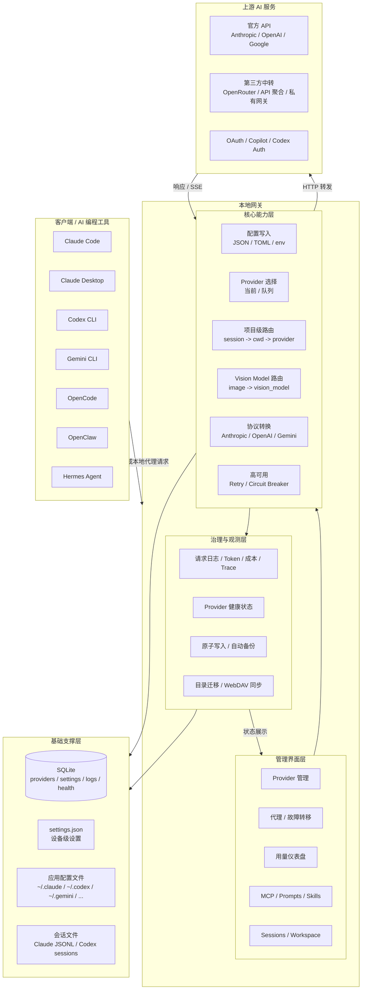

### 架构特点

| 特点       | 说明                                                                  |
| ---------- | --------------------------------------------------------------------- |
| 统一接入   | 多个 AI 编程工具在同一个桌面应用中管理 Provider、MCP、Prompts、Skills |
| 智能路由   | 代理链路中按故障转移、项目绑定、Vision Model 和模型映射决定最终上游   |
| 安全可恢复 | 接管前备份原配置，写入使用原子流程，关闭接管时恢复                    |
| 高可用     | 每个应用有独立故障转移队列、熔断器、重试与超时配置                    |
| 可观测     | 记录请求日志、Token、成本、延迟、错误、Provider 健康状态和会话 Trace |
| 可扩展     | 支持 Provider 预设、Deep Link、WebDAV、Skills 仓库和多应用同步        |

## 关键流程图索引

| 流程图                                                            | 解决的问题                                |
| ----------------------------------------------------------------- | ----------------------------------------- |
| [本地代理请求流程](#本地代理请求流程)                             | 说明一次请求如何从客户端进入代理并转发    |
| [Vision Model 代理工作原理](#vision-model-代理工作原理)           | 说明图片请求如何自动切换到视觉模型        |
| [Project Provider 代理工作原理](#project-provider-代理工作原理)   | 说明 Claude/Codex 如何按项目绑定 Provider |
| [故障转移与熔断](#故障转移与熔断)                                 | 说明高可用队列、熔断和恢复机制            |
| [MCP / Prompts / Skills 同步流程](#mcp--prompts--skills-同步流程) | 说明扩展能力如何统一管理并同步到各应用    |
| [用量统计流程](#用量统计流程)                                     | 说明 Token、成本和日志如何沉淀到仪表盘    |
| [Session Traces](#session-traces)                                 | 说明上下文 Trace 如何按用户显式开启采集   |

### 主要模块

| 模块           | 代码位置                                                                              | 作用                                                       |
| -------------- | ------------------------------------------------------------------------------------- | ---------------------------------------------------------- |
| 前端界面       | `src/components`, `src/hooks`, `src/lib/api`                                          | 管理供应商、代理、故障转移、用量、MCP、Prompts、Skills     |
| Tauri 命令     | `src-tauri/src/commands`                                                              | 暴露 Provider、Proxy、Project Routing、Settings 等后端能力 |
| 数据库         | `src-tauri/src/database`                                                              | 保存供应商、设置、请求日志、Session Traces、健康状态、备份信息 |
| 代理服务       | `src-tauri/src/proxy`                                                                 | 接收本地请求、选择 Provider、转换格式、转发、记录日志与 Trace |
| Provider 配置  | `src-tauri/src/services/provider`, `src/config/*ProviderPresets.ts`                   | 维护不同应用的预设和配置写入逻辑                           |
| 会话与项目路由 | `src-tauri/src/proxy/session_project_router.rs`, `src-tauri/src/proxy/project_router` | 从 Claude/Codex 会话文件识别项目路径并匹配 Provider        |

## Provider 配置流程

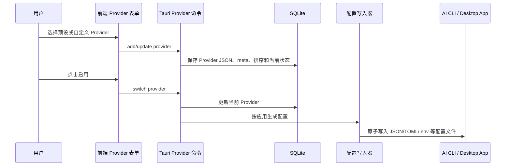

非代理模式下，切换 Provider 的本质是改写对应应用自己的配置文件。正在运行的 CLI 是否立即生效取决于该 CLI 是否会重新读取配置；代理接管模式下，Provider 切换由本地代理立即生效。

## 本地代理请求流程

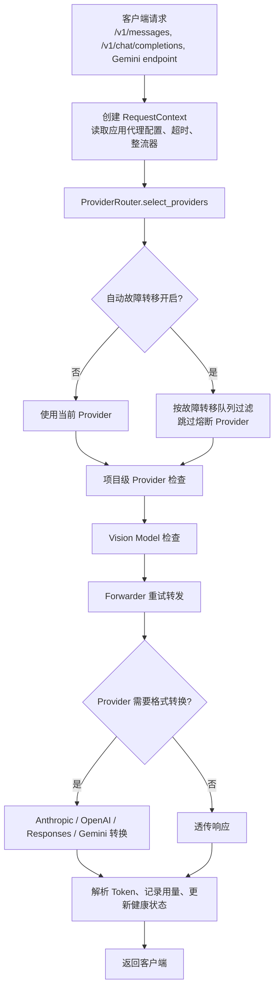

代理服务默认监听 `127.0.0.1:15721`。启动后可按应用启用接管，CC-Gateway-Pro 会将 Claude、Claude Desktop、Codex 或 Gemini 的端点指向本地代理，并在关闭接管时恢复原配置。

## Project Provider 代理工作原理

项目级绑定目前用于 Claude Code 和 Codex。它的核心不是猜当前目录，而是从各应用生成的会话记录中反查 `session_id -> cwd`，再用 `cwd -> provider_id` 的用户绑定决定实际 Provider。

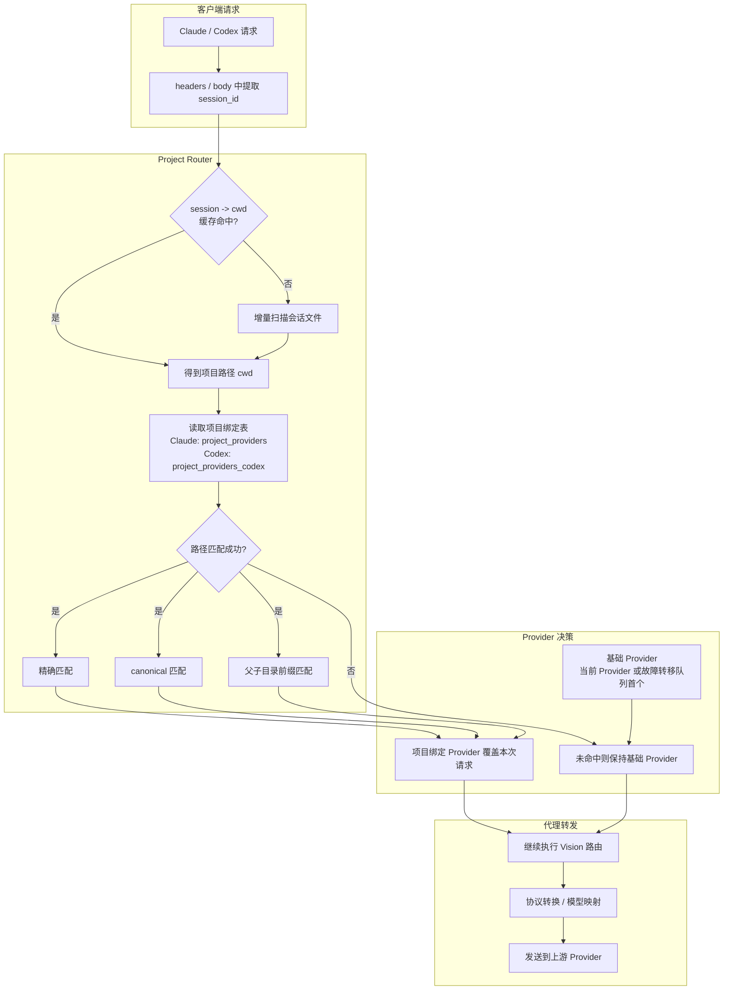

### 匹配规则

1. 精确匹配保存的项目路径。
2. 对项目路径做 canonicalize 后再匹配。
3. 使用前缀匹配处理父目录/子目录绑定。

如果没有匹配到项目绑定，请求会继续使用当前 Provider 或故障转移队列选择的 Provider。项目绑定发生在 Vision Model 检查之前，因此不同项目可以绑定不同 Provider，并分别使用自己的 `vision_model`、模型映射、API 格式和密钥。

### Project Provider 工作流

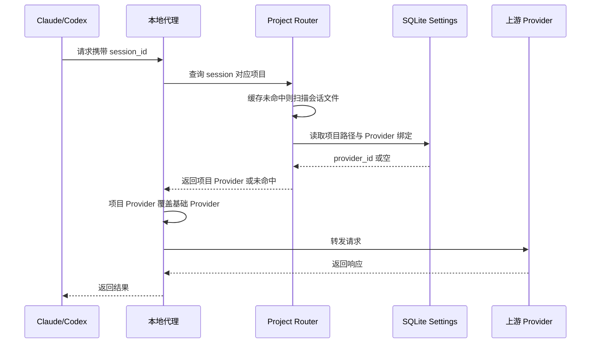

## Vision Model 代理工作原理

Provider 的 `meta.vision_model` 是 CC-Gateway-Pro 扩展字段。代理会递归检查请求体中的图片内容，支持 Anthropic、OpenAI Chat、OpenAI Responses 以及嵌套 tool_result 中的图片块。

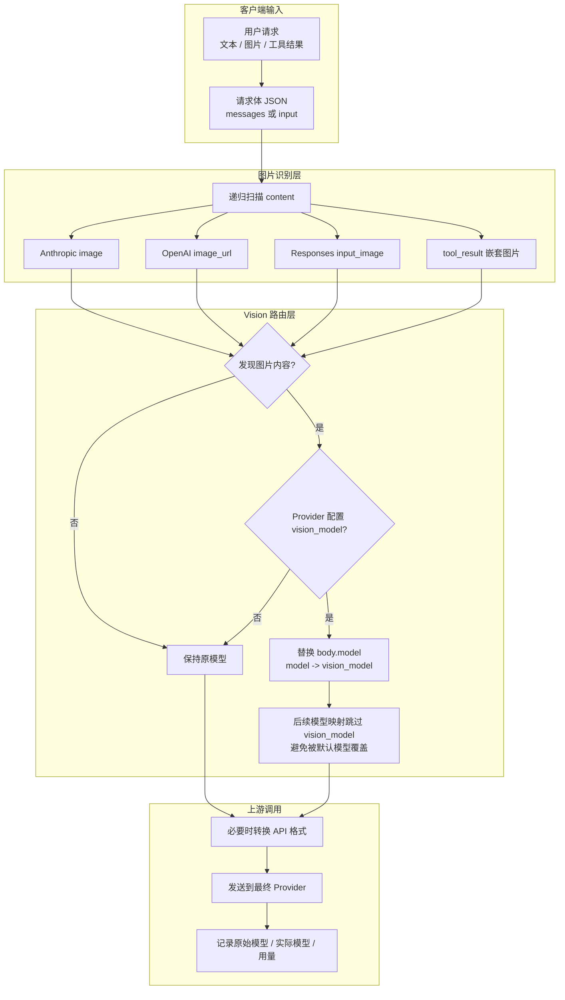

这意味着同一个 Provider 可以默认使用更便宜或更快的文本模型，而在用户粘贴图片、截图或工具返回图片时自动切换到视觉模型。

### Vision Model 工作流

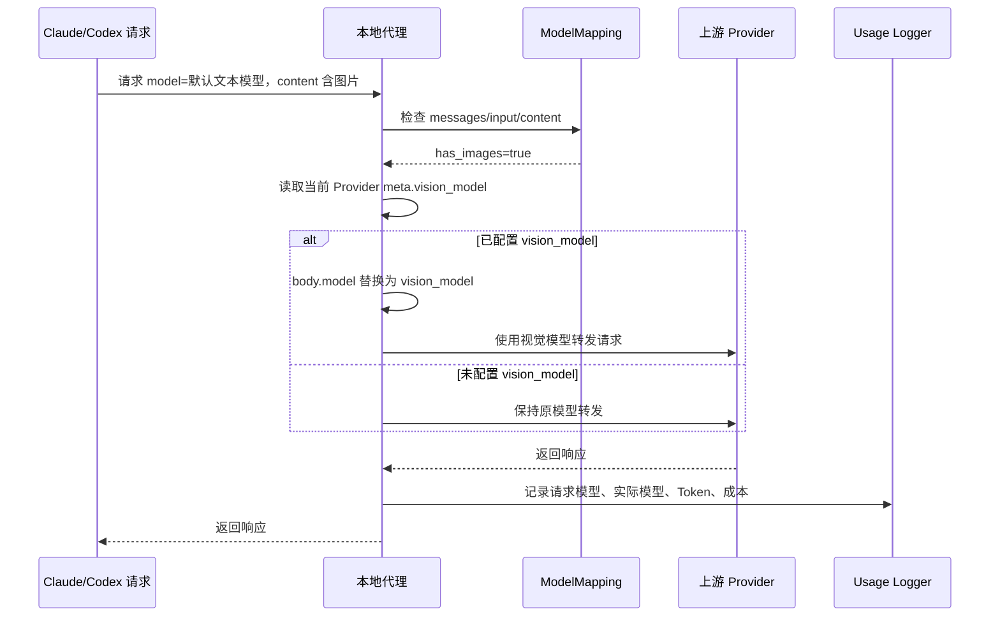

## 故障转移与熔断

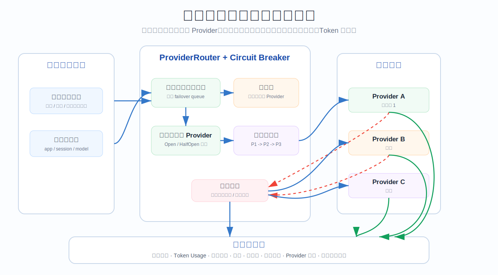

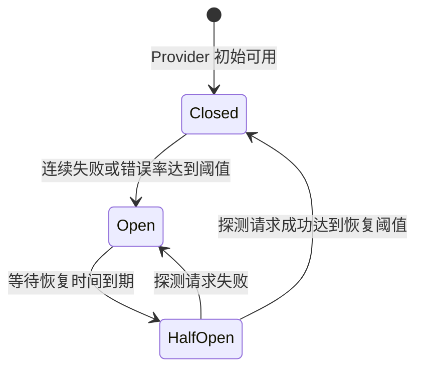

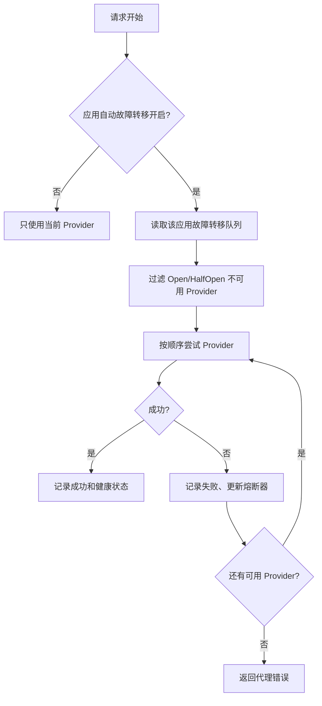

故障转移是按应用独立配置的。开启后，代理只使用故障转移队列中的 Provider，并按队列顺序尝试；关闭时只使用当前 Provider。

## MCP / Prompts / Skills 同步流程

CC-Gateway-Pro 不只管理 API Provider，也统一管理 MCP、Prompts 和 Skills。它们的共同点是：先进入数据库或统一存储，再同步到各应用自己的 live 配置文件或目录。

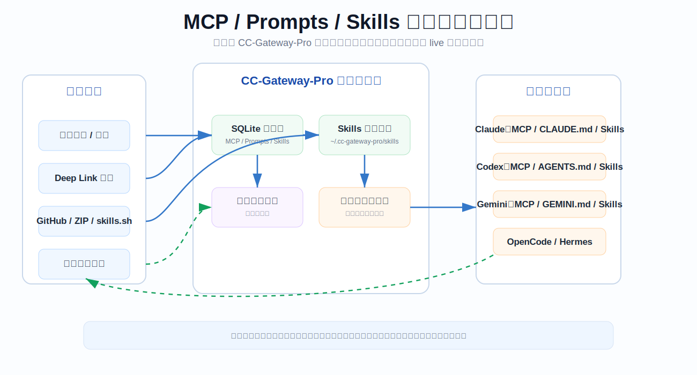

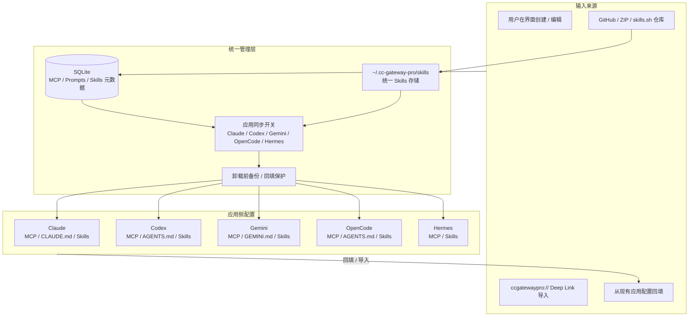

### 扩展同步要点

| 能力      | 同步方式                                                        |
| --------- | --------------------------------------------------------------- |
| MCP       | 保存统一定义后，按应用写入对应 MCP 配置                         |
| Prompts   | Markdown 预设激活后同步到 `CLAUDE.md`、`AGENTS.md`、`GEMINI.md` |
| Skills    | 默认集中存储到 `~/.cc-gateway-pro/skills`，再按应用软链或复制   |
| Deep Link | 通过 `ccgatewaypro://` 导入 Provider、MCP、Prompts、Skills      |

## 用量统计流程

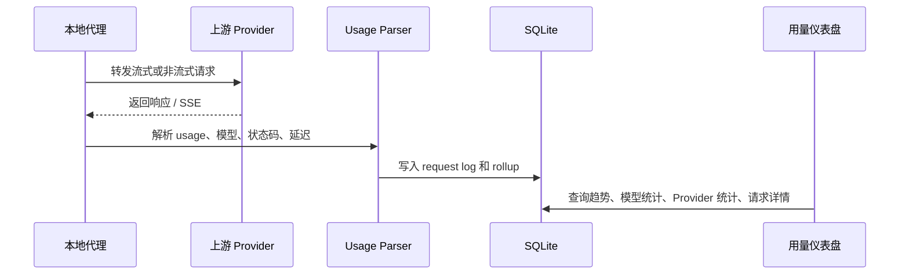

代理会尽量从不同 Provider 的响应结构中提取 token 用量；无法直接获取时，会保留请求日志和状态信息，供后续统计或定价补录。

## Session Traces

Session Traces 是独立于普通 usage 统计的上下文观察能力。它默认关闭，只有用户在「设置 → 高级 → Session Traces」或独立 Session Traces 页面显式开启后，才会记录新的会话上下文摘要、工具调用和每轮 usage。

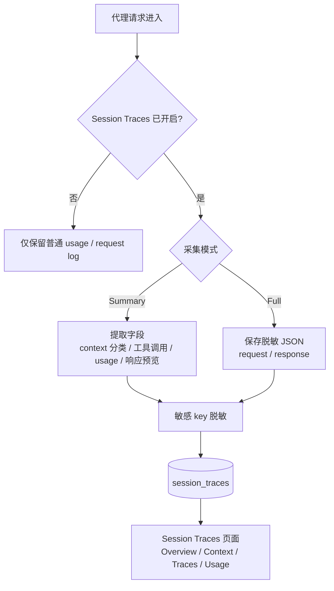

| 项目     | 行为                                                                 |
| -------- | -------------------------------------------------------------------- |
| 默认状态 | 关闭；历史 usage 仍可查看，但不会新增上下文 Trace                    |
| Summary  | 保存提取后的字段、上下文分类、工具/Skills/MCP 统计和响应预览         |
| Full     | 在脱敏后保存 request/response JSON，适合可信设备上的深度排查         |
| 保留策略 | 默认保留 14 天，响应预览默认截断到 2000 字符                         |
| 数据边界 | 数据保存在本机 SQLite；Session Traces 开关独立于普通代理日志开关     |

## 数据与备份

| 数据        | 默认位置                              |
| ----------- | ------------------------------------- |
| 主数据库    | `~/.cc-gateway-pro/cc-gateway-pro.db` |
| 设备级设置  | `~/.cc-gateway-pro/settings.json`     |
| 自动备份    | `~/.cc-gateway-pro/backups/`          |
| Skills 存储 | `~/.cc-gateway-pro/skills/`           |
| Skills 备份 | `~/.cc-gateway-pro/skill-backups/`    |

应用配置写入尽量采用原子写入和备份恢复机制。代理接管会记录接管前配置，关闭代理或关闭对应应用接管时恢复。

## 当前实现边界

- 项目级 Provider 绑定主要覆盖 Claude Code 和 Codex。
- Vision Model 自动路由依赖 Provider 配置中的 `vision_model`，未配置时不会自动猜测视觉模型。
- 故障转移只在代理模式下工作；非代理模式仍然是直接写入应用配置文件。
- OpenCode、OpenClaw、Hermes 目前主要由配置管理、扩展管理和会话/工作区能力支撑，不走完整的本地代理接管链路。
