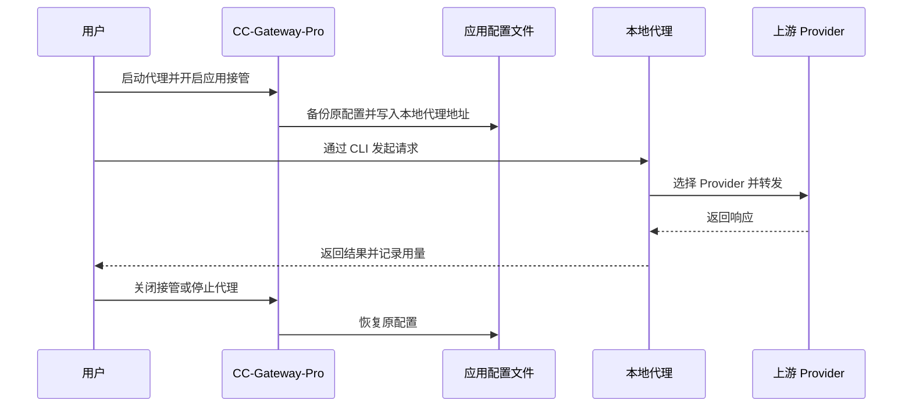
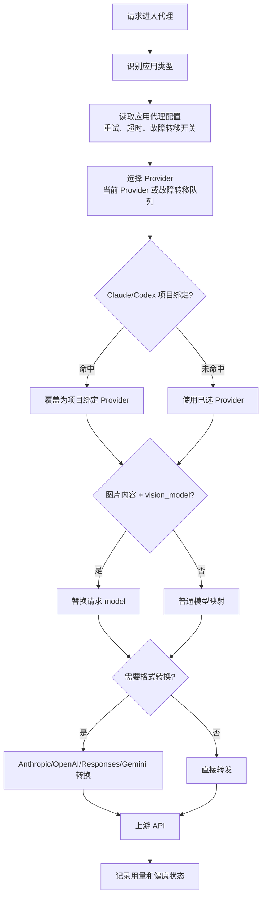
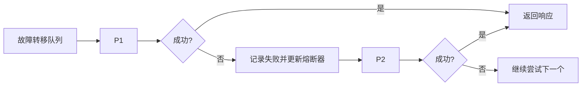

# CC-Gateway-Pro 代理功能使用指南

CC-Gateway-Pro 的代理功能是在本机启动一个 HTTP 网关，默认监听 `127.0.0.1:15721`。启用应用接管后，Claude Code、Claude Desktop、Codex 或 Gemini CLI 的请求会先进入本地代理，再由代理选择实际 Provider、转换 API 格式、记录用量，并在需要时执行项目级路由、Vision Model 自动路由和故障转移。

更完整的实现说明见 [架构与核心流程](architecture-and-flows-zh.md)。

## 重点原理图

- [CC-Gateway-Pro 总体架构](architecture-and-flows-zh.md#总体架构)
- [Vision Model 代理工作原理](architecture-and-flows-zh.md#vision-model-代理工作原理)
- [Project Provider 代理工作原理](architecture-and-flows-zh.md#project-provider-代理工作原理)
- [故障转移与熔断](architecture-and-flows-zh.md#故障转移与熔断)
- [用量统计流程](architecture-and-flows-zh.md#用量统计流程)

## 适用场景

- 希望切换 Provider 后不重启 CLI。
- 希望记录请求日志、Token 用量、成本和延迟。
- 希望使用自动故障转移和熔断器提高可用性。
- 希望 Claude/Codex 不同项目自动使用不同 Provider。
- 希望包含图片的请求自动切换到视觉模型。
- 希望把不同 Provider 的 API 格式适配给 Claude Code 或 Claude Desktop。

## 快速开始

1. 打开 CC-Gateway-Pro 的「代理」面板。
2. 点击「启动代理」，默认地址为 `http://127.0.0.1:15721`。
3. 为需要的应用开启接管：Claude、Claude Desktop、Codex 或 Gemini。
4. 正常使用对应 CLI/桌面应用。请求会经本地代理转发到当前 Provider。
5. 不再需要时关闭应用接管或停止代理，CC-Gateway-Pro 会恢复接管前配置。

## 请求处理顺序

## 应用接管会修改什么

| 应用           | 典型修改内容                                  | 说明                                 |
| -------------- | --------------------------------------------- | ------------------------------------ |
| Claude Code    | `ANTHROPIC_BASE_URL` 指向本地代理             | 代理处理 `/v1/messages` 并可转换格式 |
| Claude Desktop | 写入本地路由 profile 或指向 `/claude-desktop` | 支持直连模式与模型映射路由模式       |
| Codex          | `base_url` 指向本地代理的 OpenAI 兼容地址     | 支持 Codex 请求转发、日志与项目路由  |
| Gemini CLI     | `GOOGLE_GEMINI_BASE_URL` 指向本地代理         | 支持 Gemini 请求转发与用量记录       |

接管前配置会被保存，关闭接管或停止代理时恢复。若应用配置被其他程序同时修改，建议重新打开 CC-Gateway-Pro 后再关闭接管，让它重新检测状态。

## 项目级 Provider 绑定

Claude 和 Codex 的项目级路由依赖会话文件中的 `session_id -> cwd` 映射：

- Claude：扫描 `~/.claude/projects/` 下的 JSONL 会话文件。
- Codex：使用 Codex session scanner 扫描本地会话记录。
- 绑定关系保存到数据库 settings 中：Claude 使用 `project_providers`，Codex 使用 `project_providers_codex`。

匹配顺序为：精确路径、canonical 路径、前缀路径。未匹配时使用当前 Provider 或故障转移队列选择的 Provider。

## Vision Model 自动路由

当 Provider 配置了 `vision_model`，代理会检查请求体中的图片内容：

- Anthropic：`image`
- OpenAI Chat：`image_url`
- OpenAI Responses：`input_image`
- 嵌套 `tool_result.content` 中的图片块

命中后，代理会把请求中的 `model` 替换为该 Provider 的 `vision_model`。未配置 `vision_model` 时不会自动猜测模型。

## 故障转移

故障转移按应用独立配置。开启自动故障转移后，代理只使用该应用的故障转移队列，并按队列顺序尝试 Provider。

熔断器有 Closed、Open、HalfOpen 三种状态。Provider 连续失败或错误率达到阈值后进入 Open，恢复时间到期后进入 HalfOpen 进行探测，探测成功达到阈值后回到 Closed。

## 常见问题

### 代理启动失败，提示端口被占用

默认端口是 `15721`。可以关闭占用端口的程序，或在代理配置里改成其他端口后重新启动。

### 开启接管后请求失败

请检查：

1. 代理服务是否运行。
2. 对应应用接管是否开启。
3. 当前 Provider 的 API Key、Base URL 和模型是否正确。
4. 如果使用项目绑定，目标项目绑定的 Provider 是否仍存在。
5. 如果请求包含图片，Provider 是否配置了可用的 `vision_model`。

### 故障转移没有生效

请确认：

1. 已启动代理并开启对应应用接管。
2. 该应用已开启自动故障转移。
3. 故障转移队列中至少有一个可用 Provider。
4. 队列中的 Provider 没有全部处于熔断状态。

### 停止代理后配置没有恢复

通常重新打开 CC-Gateway-Pro 后再关闭一次对应应用接管即可恢复。如果应用配置在接管期间被手动修改，建议在 CC-Gateway-Pro 中重新保存目标 Provider，重新写入一份干净配置。
