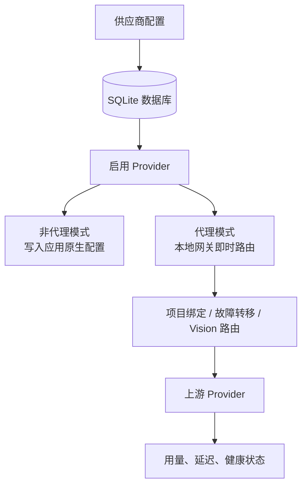

# 1.1 软件介绍

## 什么是 CC-Gateway-Pro

CC-Gateway-Pro 是一款跨平台桌面应用，专为使用 AI 编程工具的开发者设计。它帮助你统一管理 **Claude Code**、**Claude Desktop**、**Codex**、**Gemini CLI**、**OpenCode**、**OpenClaw** 和 **Hermes Agent** 的供应商配置、扩展配置和本地代理请求。

本项目基于 [farion1231/cc-switch](https://github.com/farion1231/cc-switch) fork 后继续开发。相较于原项目的可视化 Provider 切换，CC-Gateway-Pro 进一步加入了本地代理网关、项目级 Provider 绑定、Vision Model 自动路由、自动故障转移、用量统计和 Claude Desktop 第三方接入等能力。

## 解决什么问题

在日常开发中，你可能会遇到这些痛点：

- **多供应商切换麻烦**：使用不同的 API 供应商（官方、中转服务商），需要手动修改配置文件
- **配置分散难管理**：Claude、Codex、Gemini、OpenCode、OpenClaw、Hermes 等应用各有独立的配置文件，格式不同
- **无法监控用量**：不知道 API 调用了多少次，花了多少钱
- **服务不稳定**：单一供应商出问题时，整个工作流中断
- **多项目难隔离**：不同项目可能需要不同 Provider、额度或模型策略
- **多模态请求易失败**：默认文本模型遇到图片请求时可能不支持视觉输入

CC-Gateway-Pro 通过统一的界面解决这些问题。

## 核心功能

### 供应商管理

- 一键切换多个 API 供应商配置
- 支持预设模板，快速添加常用供应商
- 统一供应商功能，跨应用共享配置
- 用量查询与余额显示
- 端点速度测试

### 扩展功能

- **MCP 服务器**：管理 Model Context Protocol 服务器，扩展 AI 能力
- **Prompts**：管理系统提示词预设，快速切换不同场景
- **Skills**：安装和管理技能扩展

### 代理与高可用

- 本地代理服务，记录请求日志和用量统计
- 自动故障转移，主供应商失败时自动切换备用
- 熔断器机制，防止频繁重试失败的供应商
- 详细的 Token 用量追踪与成本估算
- Claude/Codex 项目级 Provider 绑定
- 图片请求自动切换到 Provider 配置的 Vision Model

## 核心工作方式

## 支持的应用

| 应用               | 说明                                             |
| ------------------ | ------------------------------------------------ |
| **Claude Code**    | Anthropic 官方的 AI 编程助手                     |
| **Claude Desktop** | Anthropic 桌面客户端，支持官方配置和本地路由模式 |
| **Codex**          | OpenAI 的代码生成工具                            |
| **Gemini CLI**     | Google 的 AI 命令行工具                          |
| **OpenCode**       | 开源 AI 编程终端工具                             |
| **OpenClaw**       | 开源 AI 编程助手（多供应商网关）                 |
| **Hermes Agent**   | Agent 工作流工具，支持供应商与扩展管理           |

## 支持的平台

- **Windows** 10 及以上
- **macOS** 12 (Monterey) 及以上
- **Linux** Ubuntu 22.04+ / Debian 11+ / Fedora 34+

## 技术架构

CC-Gateway-Pro 使用现代化的技术栈构建：

- **前端**：React 18 + TypeScript + Tailwind CSS
- **后端**：Tauri 2 + Rust
- **数据存储**：SQLite（供应商、MCP、Prompts）+ JSON（设备设置）

这种架构确保了：

- 跨平台一致的体验
- 原生级别的性能
- 安全的本地数据存储
