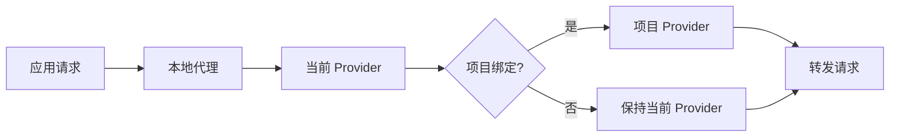

# 4.2 应用路由

## 功能说明

应用路由，也叫应用接管，是指让 CC-Gateway-Pro 修改特定应用的 API 端点，使请求先进入本地代理，再由代理转发到真实 Provider。

开启路由后：

- 应用的 API 请求会通过本地路由转发
- 可以记录请求日志和统计用量
- 可以使用故障转移功能
- 可以使用 Claude/Codex 项目级 Provider 绑定
- 可以使用 Vision Model 自动路由

## 前提条件

使用应用路由功能前，需要先启动路由服务。

## 开启路由

### 操作位置

设置 → 高级 → 路由服务 → 应用路由区域

### 操作步骤

1. 确保路由服务已启动
2. 找到「应用路由」区域
3. 为需要的应用开启开关

### 路由开关

| 开关                | 作用                                           |
| ------------------- | ---------------------------------------------- |
| Claude 路由         | 路由 Claude Code 的请求                        |
| Claude Desktop 路由 | 为 Claude Desktop 第三方供应商提供本地模型路由 |
| Codex 路由          | 路由 Codex 的请求                              |
| Gemini 路由         | 路由 Gemini CLI 的请求                         |

可以同时开启多个应用的路由。

## 路由原理

### 配置修改

开启路由后，CC-Gateway-Pro 会修改应用的配置文件，将 API 端点指向本地路由。

**Claude 配置变更**：

```json
// 路由前
{
  "env": {
    "ANTHROPIC_BASE_URL": "https://api.anthropic.com"
  }
}

// 路由后
{
  "env": {
    "ANTHROPIC_BASE_URL": "http://127.0.0.1:15721"
  }
}
```

**Codex 配置变更**：

```toml
# 路由前
base_url = "https://api.openai.com/v1"

# 路由后
base_url = "http://127.0.0.1:15721/v1"
```

**Gemini 配置变更**：

```bash
# 路由前
GOOGLE_GEMINI_BASE_URL=https://generativelanguage.googleapis.com

# 路由后
GOOGLE_GEMINI_BASE_URL=http://127.0.0.1:15721
```

### 请求转发

路由收到请求后：

1. 识别请求来源（Claude/Claude Desktop/Codex/Gemini）
2. 查找该应用当前启用的供应商
3. 如果是 Claude 或 Codex，检查当前 session 是否绑定到项目 Provider
4. 如果请求包含图片且 Provider 配置了 `vision_model`，自动替换请求模型
5. 必要时执行 Anthropic/OpenAI/Gemini 格式转换
6. 将请求转发到供应商的实际端点
7. 记录请求日志、Token 用量和健康状态
8. 返回响应给应用



## 路由状态指示

### 主界面指示

开启路由后，主界面会有以下变化：

- **路由 Logo 颜色**：从无色变为绿色
- **供应商卡片**：当前活跃的供应商显示绿色边框

### 供应商卡片状态

| 状态     | 边框颜色 | 说明                             |
| -------- | -------- | -------------------------------- |
| 当前启用 | 蓝色     | 配置文件中的供应商（非路由模式） |
| 路由活跃 | 绿色     | 路由实际使用的供应商             |
| 普通     | 默认     | 未使用的供应商                   |

## 关闭路由

### 操作步骤

1. 在路由面板中关闭对应应用的路由开关
2. 或直接停止路由服务

### 配置恢复

关闭路由时，CC-Gateway-Pro 会：

1. 将应用配置恢复到路由前的状态
2. 保存当前的请求日志

## 路由与供应商切换

### 路由模式下切换供应商

在路由模式下切换供应商：

1. 在主界面点击供应商的「启用」按钮
2. 路由立即使用新供应商转发请求
3. **无需重启 CLI 工具**

这是路由模式的一大优势：切换供应商即时生效。

### 非路由模式下切换

在非路由模式下切换供应商：

1. 修改配置文件
2. 需要重启 CLI 工具才能生效

## 多应用路由

可以同时路由多个应用，每个应用独立管理：

- 独立的供应商配置
- 独立的故障转移队列
- 独立的请求统计
- 独立的代理超时和熔断器参数

## 使用场景

### 场景一：用量监控

开启路由 + 日志记录，监控 API 使用情况。

### 场景二：快速切换

开启路由后，切换供应商无需重启 CLI 工具。

### 场景三：故障转移

开启路由是使用故障转移功能的前提。

## 注意事项

### 性能影响

路由会增加少量延迟（通常 < 10ms），对于大多数场景可以忽略。

### 网络要求

路由模式下，CLI 工具需要能够访问本地路由地址。

### 配置备份

开启路由前，CC-Gateway-Pro 会备份原始配置，关闭时恢复。

## 常见问题

### 路由后请求失败

检查：

- 路由服务是否正常运行
- 供应商配置是否正确
- 网络是否正常

### 关闭路由后配置未恢复

可能原因：

- 路由异常退出
- 配置文件被其他程序修改

解决方法：

- 手动编辑供应商，重新保存
- 或重新启用再关闭路由
